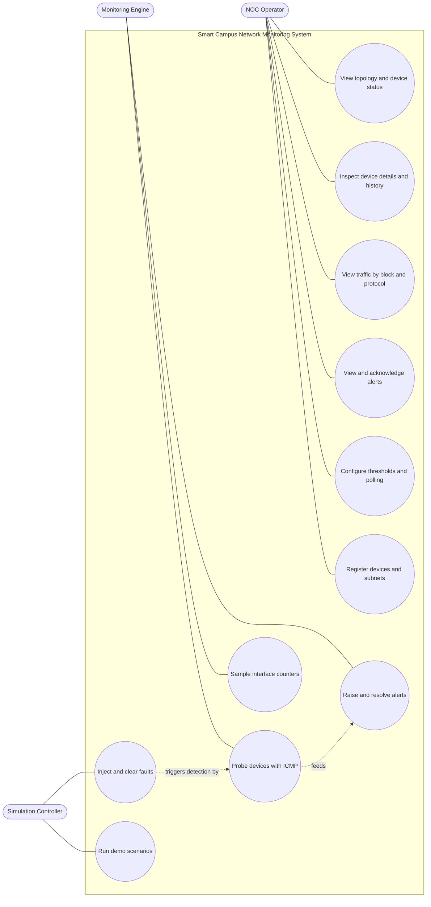

# 1. Use case diagram

Mermaid has no UML use-case notation, so actors and use cases are drawn as a flowchart.

```mermaid
flowchart LR
    operator([NOC Operator])
    controller([Simulation Controller])
    monitor([Monitoring Engine])

    subgraph system [Smart Campus Network Monitoring System]
        uc1((View topology and device status))
        uc2((Inspect device details and history))
        uc3((View traffic by block and protocol))
        uc4((View and acknowledge alerts))
        uc5((Configure thresholds and polling))
        uc6((Register devices and subnets))
        uc7((Inject and clear faults))
        uc8((Run demo scenarios))
        uc9((Probe devices with ICMP))
        uc10((Sample interface counters))
        uc11((Raise and resolve alerts))
    end

    operator --- uc1
    operator --- uc2
    operator --- uc3
    operator --- uc4
    operator --- uc5
    operator --- uc6
    controller --- uc7
    controller --- uc8
    monitor --- uc9
    monitor --- uc10
    monitor --- uc11
    uc7 -. triggers detection by .-> uc9
    uc9 -. feeds .-> uc11
```
