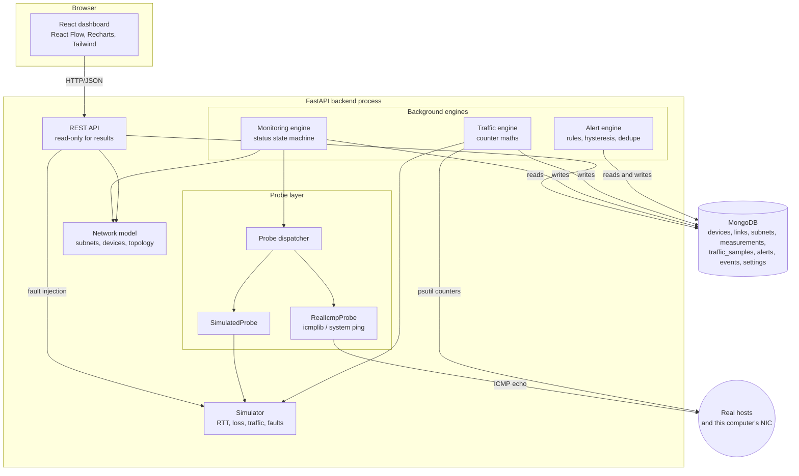

# 2. Component diagram

```mermaid
flowchart TB
    subgraph browser [Browser]
        ui[React dashboard<br/>React Flow, Recharts, Tailwind]
    end

    subgraph backend [FastAPI backend process]
        api[REST API<br/>read-only for results]
        subgraph engines [Background engines]
            mon[Monitoring engine<br/>status state machine]
            tra[Traffic engine<br/>counter maths]
            ale[Alert engine<br/>rules, hysteresis, dedupe]
        end
        subgraph probes [Probe layer]
            disp[Probe dispatcher]
            real[RealIcmpProbe<br/>icmplib / system ping]
            simp[SimulatedProbe]
        end
        sim[Simulator<br/>RTT, loss, traffic, faults]
        model[Network model<br/>subnets, devices, topology]
    end

    db[(MongoDB<br/>devices, links, subnets, measurements,<br/>traffic_samples, alerts, events, settings)]
    net((Real hosts<br/>and this computer's NIC))

    ui -- HTTP/JSON --> api
    api -- reads --> db
    api -- fault injection --> sim
    mon --> disp
    disp --> real
    disp --> simp
    simp --> sim
    real -- ICMP echo --> net
    tra --> sim
    tra -- psutil counters --> net
    mon -- writes --> db
    tra -- writes --> db
    ale -- reads and writes --> db
    mon --> model
    api --> model
```
