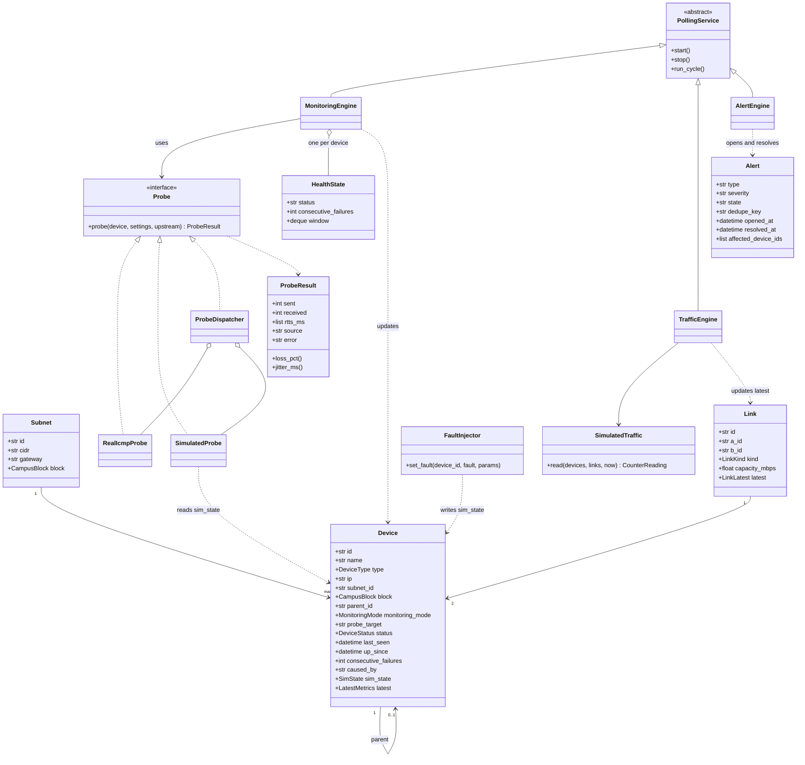

# 3. Class diagram

```mermaid
classDiagram
    class Device {
        +str id
        +str name
        +DeviceType type
        +str ip
        +str subnet_id
        +CampusBlock block
        +str parent_id
        +MonitoringMode monitoring_mode
        +str probe_target
        +DeviceStatus status
        +datetime last_seen
        +datetime up_since
        +int consecutive_failures
        +str caused_by
        +SimState sim_state
        +LatestMetrics latest
    }
    class Subnet {
        +str id
        +str cidr
        +str gateway
        +CampusBlock block
    }
    class Link {
        +str id
        +str a_id
        +str b_id
        +LinkKind kind
        +float capacity_mbps
        +LinkLatest latest
    }
    class Probe {
        <<interface>>
        +probe(device, settings, upstream) ProbeResult
    }
    class RealIcmpProbe
    class SimulatedProbe
    class ProbeDispatcher
    class ProbeResult {
        +int sent
        +int received
        +list rtts_ms
        +str source
        +str error
        +loss_pct()
        +jitter_ms()
    }
    class PollingService {
        <<abstract>>
        +start()
        +stop()
        +run_cycle()
    }
    class MonitoringEngine
    class TrafficEngine
    class AlertEngine
    class HealthState {
        +str status
        +int consecutive_failures
        +deque window
    }
    class Alert {
        +str type
        +str severity
        +str state
        +str dedupe_key
        +datetime opened_at
        +datetime resolved_at
        +list affected_device_ids
    }
    class FaultInjector {
        +set_fault(device_id, fault, params)
    }
    class SimulatedTraffic {
        +read(devices, links, now) CounterReading
    }

    Probe <|.. RealIcmpProbe
    Probe <|.. SimulatedProbe
    Probe <|.. ProbeDispatcher
    ProbeDispatcher o-- RealIcmpProbe
    ProbeDispatcher o-- SimulatedProbe
    PollingService <|-- MonitoringEngine
    PollingService <|-- TrafficEngine
    PollingService <|-- AlertEngine
    MonitoringEngine --> Probe : uses
    MonitoringEngine o-- HealthState : one per device
    MonitoringEngine ..> Device : updates
    TrafficEngine --> SimulatedTraffic
    TrafficEngine ..> Link : updates latest
    AlertEngine ..> Alert : opens and resolves
    Subnet "1" --> "many" Device
    Device "1" --> "0..1" Device : parent
    Link "1" --> "2" Device
    FaultInjector ..> Device : writes sim_state
    SimulatedProbe ..> Device : reads sim_state
    Probe ..> ProbeResult
```
