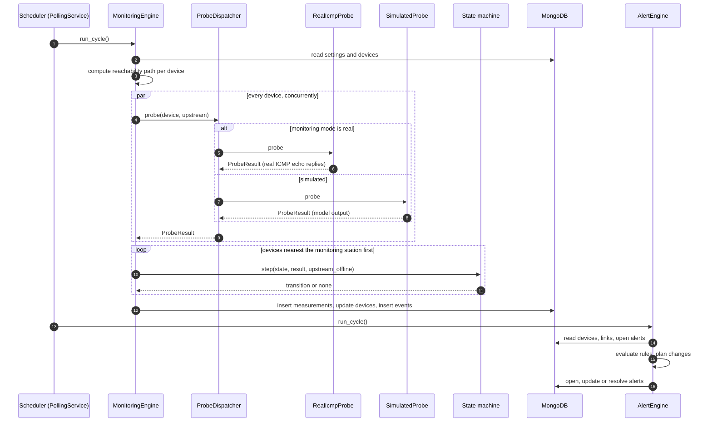

# 4. Monitoring sequence diagram (one cycle)

```mermaid
sequenceDiagram
    autonumber
    participant S as Scheduler (PollingService)
    participant E as MonitoringEngine
    participant D as ProbeDispatcher
    participant R as RealIcmpProbe
    participant M as SimulatedProbe
    participant SM as State machine
    participant DB as MongoDB
    participant A as AlertEngine

    S->>E: run_cycle()
    E->>DB: read settings and devices
    E->>E: compute reachability path per device
    par every device, concurrently
        E->>D: probe(device, upstream)
        alt monitoring mode is real
            D->>R: probe
            R-->>D: ProbeResult (real ICMP echo replies)
        else simulated
            D->>M: probe
            M-->>D: ProbeResult (model output)
        end
        D-->>E: ProbeResult
    end
    loop devices nearest the monitoring station first
        E->>SM: step(state, result, upstream_offline)
        SM-->>E: transition or none
    end
    E->>DB: insert measurements, update devices, insert events
    S->>A: run_cycle()
    A->>DB: read devices, links, open alerts
    A->>A: evaluate rules, plan changes
    A->>DB: open, update or resolve alerts
```
