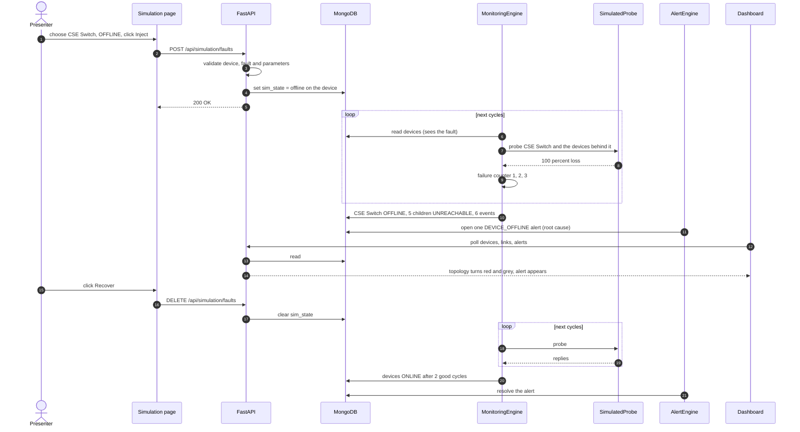

# 5. Failure simulation sequence diagram

```mermaid
sequenceDiagram
    autonumber
    actor U as Presenter
    participant UI as Simulation page
    participant API as FastAPI
    participant DB as MongoDB
    participant E as MonitoringEngine
    participant P as SimulatedProbe
    participant A as AlertEngine
    participant D as Dashboard

    U->>UI: choose CSE Switch, OFFLINE, click Inject
    UI->>API: POST /api/simulation/faults
    API->>API: validate device, fault and parameters
    API->>DB: set sim_state = offline on the device
    API-->>UI: 200 OK
    loop next cycles
        E->>DB: read devices (sees the fault)
        E->>P: probe CSE Switch and the devices behind it
        P-->>E: 100 percent loss
        E->>E: failure counter 1, 2, 3
    end
    E->>DB: CSE Switch OFFLINE, 5 children UNREACHABLE, 6 events
    A->>DB: open one DEVICE_OFFLINE alert (root cause)
    D->>API: poll devices, links, alerts
    API->>DB: read
    API-->>D: topology turns red and grey, alert appears
    U->>UI: click Recover
    UI->>API: DELETE /api/simulation/faults
    API->>DB: clear sim_state
    loop next cycles
        E->>P: probe
        P-->>E: replies
    end
    E->>DB: devices ONLINE after 2 good cycles
    A->>DB: resolve the alert
```
