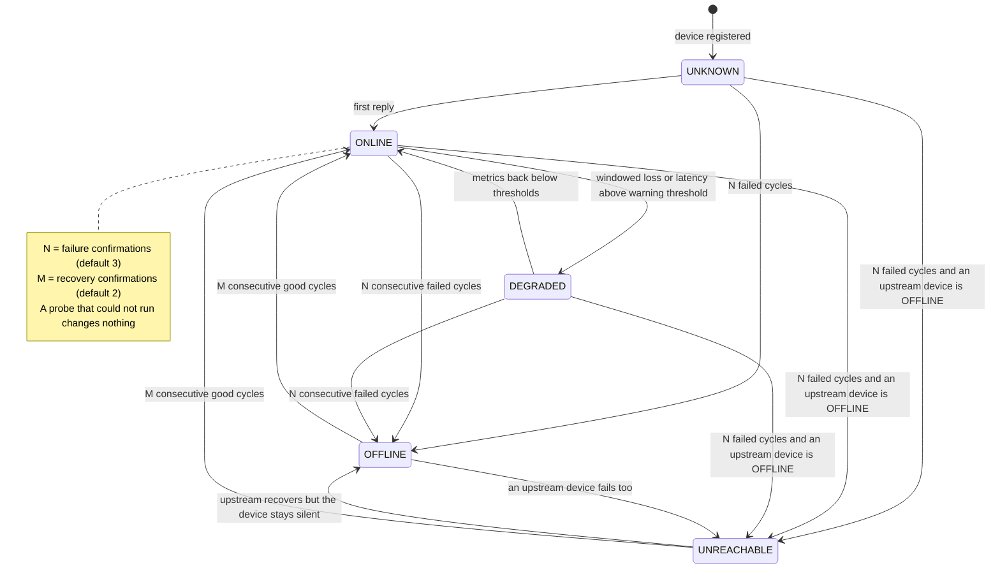

# 6. Device status state machine

```mermaid
stateDiagram-v2
    [*] --> UNKNOWN : device registered
    UNKNOWN --> ONLINE : first reply
    UNKNOWN --> OFFLINE : N failed cycles
    UNKNOWN --> UNREACHABLE : N failed cycles and an upstream device is OFFLINE
    ONLINE --> DEGRADED : windowed loss or latency above warning threshold
    DEGRADED --> ONLINE : metrics back below thresholds
    ONLINE --> OFFLINE : N consecutive failed cycles
    DEGRADED --> OFFLINE : N consecutive failed cycles
    ONLINE --> UNREACHABLE : N failed cycles and an upstream device is OFFLINE
    DEGRADED --> UNREACHABLE : N failed cycles and an upstream device is OFFLINE
    OFFLINE --> UNREACHABLE : an upstream device fails too
    UNREACHABLE --> OFFLINE : upstream recovers but the device stays silent
    OFFLINE --> ONLINE : M consecutive good cycles
    UNREACHABLE --> ONLINE : M consecutive good cycles
    note right of ONLINE
        N = failure confirmations (default 3)
        M = recovery confirmations (default 2)
        A probe that could not run changes nothing
    end note
```
