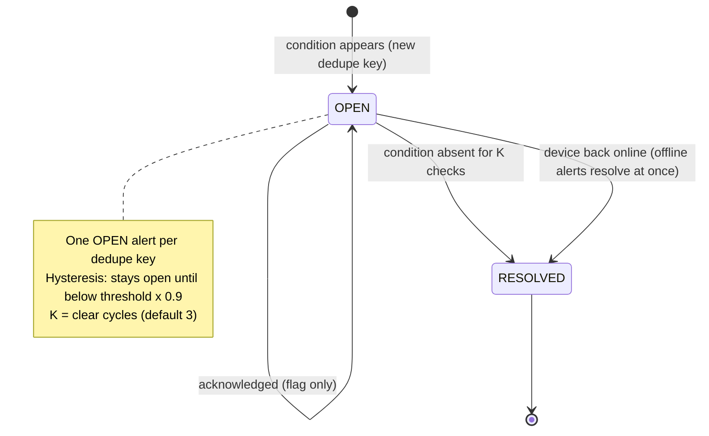

# 7. Alert state machine

```mermaid
stateDiagram-v2
    [*] --> OPEN : condition appears (new dedupe key)
    OPEN --> OPEN : condition persists (update values, keep one alert)
    OPEN --> OPEN : severity changes (warning to critical or back)
    OPEN --> OPEN : condition absent but fewer than K checks (clear delay)
    OPEN --> OPEN : acknowledged (flag only)
    OPEN --> RESOLVED : condition absent for K checks
    OPEN --> RESOLVED : device back online (offline alerts resolve at once)
    RESOLVED --> [*]
    note right of OPEN
        One OPEN alert per dedupe key
        Hysteresis: stays open until below threshold x 0.9
        K = clear cycles (default 3)
    end note
```
