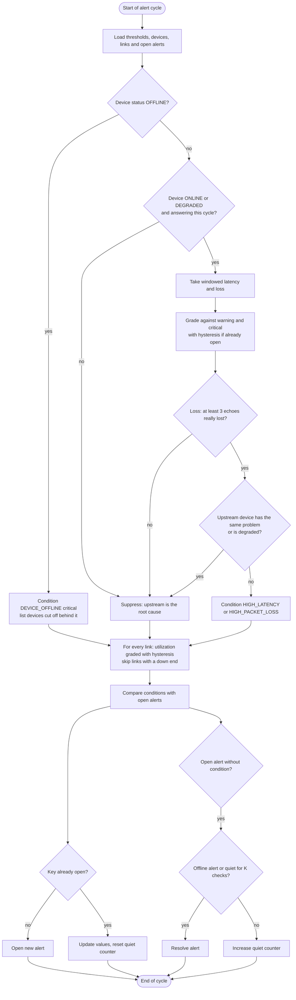

# 8. Activity diagram: alert evaluation

```mermaid
flowchart TD
    start([Start of alert cycle]) --> load[Load thresholds, devices, links and open alerts]
    load --> off{Device status OFFLINE?}
    off -- yes --> offc[Condition DEVICE_OFFLINE critical<br/>list devices cut off behind it]
    off -- no --> reach{Device ONLINE or DEGRADED<br/>and answering this cycle?}
    reach -- no --> next
    reach -- yes --> val[Take windowed latency and loss]
    val --> grade[Grade against warning and critical<br/>with hysteresis if already open]
    grade --> ev{Loss: at least 3 echoes really lost?}
    ev -- no --> next
    ev -- yes --> sup{Upstream device has the same problem<br/>or is degraded?}
    sup -- yes --> next[Suppress: upstream is the root cause]
    sup -- no --> cond[Condition HIGH_LATENCY or HIGH_PACKET_LOSS]
    offc --> util
    cond --> util
    next --> util[For every link: utilization graded with hysteresis<br/>skip links with a down end]
    util --> plan[Compare conditions with open alerts]
    plan --> a{Key already open?}
    a -- no --> open[Open new alert]
    a -- yes --> upd[Update values, reset quiet counter]
    plan --> b{Open alert without condition?}
    b -- yes --> k{Offline alert or quiet for K checks?}
    k -- yes --> res[Resolve alert]
    k -- no --> q[Increase quiet counter]
    open --> done([End of cycle])
    upd --> done
    res --> done
    q --> done
```
