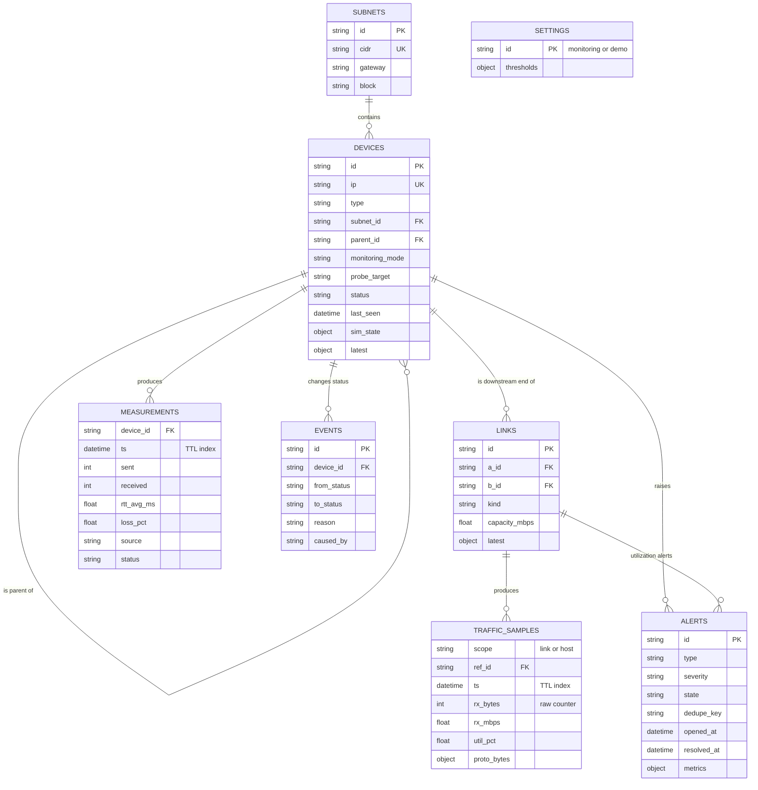

# 9. ER / database diagram

```mermaid
erDiagram
    SUBNETS ||--o{ DEVICES : contains
    DEVICES ||--o{ DEVICES : "is parent of"
    DEVICES ||--o{ LINKS : "is downstream end of"
    DEVICES ||--o{ MEASUREMENTS : produces
    DEVICES ||--o{ EVENTS : "changes status"
    DEVICES ||--o{ ALERTS : raises
    LINKS ||--o{ TRAFFIC_SAMPLES : produces
    LINKS ||--o{ ALERTS : "utilization alerts"

    SUBNETS {
        string id PK
        string cidr UK
        string gateway
        string block
    }
    DEVICES {
        string id PK
        string ip UK
        string type
        string subnet_id FK
        string parent_id FK
        string monitoring_mode
        string probe_target
        string status
        datetime last_seen
        object sim_state
        object latest
    }
    LINKS {
        string id PK
        string a_id FK
        string b_id FK
        string kind
        float capacity_mbps
        object latest
    }
    MEASUREMENTS {
        string device_id FK
        datetime ts "TTL index"
        int sent
        int received
        float rtt_avg_ms
        float loss_pct
        string source
        string status
    }
    TRAFFIC_SAMPLES {
        string scope "link or host"
        string ref_id FK
        datetime ts "TTL index"
        int rx_bytes "raw counter"
        float rx_mbps
        float util_pct
        object proto_bytes
    }
    ALERTS {
        string id PK
        string type
        string severity
        string state
        string dedupe_key
        datetime opened_at
        datetime resolved_at
        object metrics
    }
    EVENTS {
        string id PK
        string device_id FK
        string from_status
        string to_status
        string reason
        string caused_by
    }
    SETTINGS {
        string id PK "monitoring or demo"
        object thresholds
    }
```
