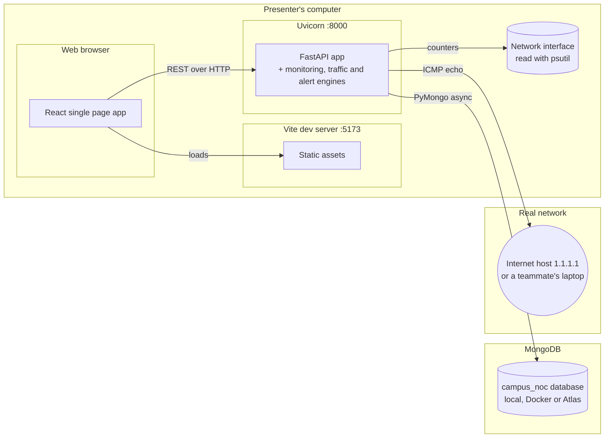

# 10. Deployment diagram

```mermaid
flowchart LR
    subgraph laptop [Presenter's computer]
        subgraph bro [Web browser]
            spa[React single page app]
        end
        subgraph vite [Vite dev server :5173]
            assets[Static assets]
        end
        subgraph uv [Uvicorn :8000]
            app[FastAPI app<br/>+ monitoring, traffic and alert engines]
        end
        nic[(Network interface<br/>read with psutil)]
    end
    subgraph dbhost [MongoDB]
        mongo[(campus_noc database<br/>local, Docker or Atlas)]
    end
    subgraph lan [Real network]
        isp((Internet host 1.1.1.1<br/>or a teammate's laptop))
    end

    spa -- loads --> assets
    spa -- REST over HTTP --> app
    app -- PyMongo async --> mongo
    app -- ICMP echo --> isp
    app -- counters --> nic
```
